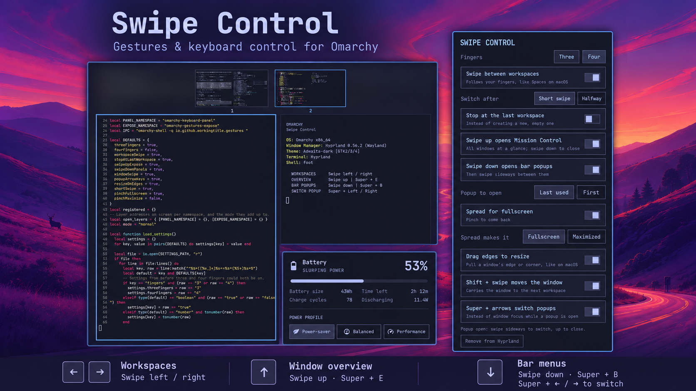

# Swipe Control

Your trackpad, the way macOS taught you to use it, on Omarchy.

Swipe between workspaces with the page following your fingers. Swipe up for
Mission Control with live window previews. Swipe down to open the popups on
the right of the bar and swipe sideways through them, like Control Center.
Hold Shift while swiping to carry the focused window along to the next
workspace, and resize windows by dragging their edges and corners. Every
gesture can be switched off in a settings popup in the bar.



## Gestures

| Three fingers, four, or both (see Settings) | Normally | While a bar popup is open | While Mission Control is open |
|---|---|---|---|
| Left / right | Switch workspace, 1:1 with your fingers | Step to the neighbouring popup | Switch workspace |
| Shift + left / right | Carry the focused window to the workspace on that side | same | same |
| Up | Open Mission Control | Close the popup | — |
| Down | Open a bar popup (the last used one, or the first) | — | Close Mission Control |
| Spread / pinch | Make the focused window fullscreen / bring it back | same | — |

As on macOS, a short swipe is enough to move on to the next workspace: the
switch commits after 30 % of the swipe distance or a brisk flick, instead of
Hyprland's default of half the distance. Choose **Halfway** in the settings for
the default behaviour.

Spreading your fingers grows the focused window to fullscreen as it follows
them, and pinching brings it back, as on macOS. Two-finger pinch stays with the
apps (zooming in the browser); the fullscreen pinch uses the same finger count
as the other gestures.

The window is dragged the way your fingers move, so Shift + swiping right
moves it to the workspace on the right. Moving a window past the last
workspace creates a new one.

## Mission Control

Each monitor shows its workspaces as thumbnails along the top and the windows
of the active workspace spread out below, with live previews. The desktop
behind is blurred.

- Click a window to focus it, or pick one with Tab or the up and down arrows
  and press Enter.
- Click a workspace to switch to it, or step through the workspaces with the
  left and right arrows; Enter closes Mission Control there.
- Drag a window onto a workspace thumbnail to move it there.
- Swipe down, press Escape, or click empty space to close it.

## Resizing windows

With **Drag edges to resize** on, point at a window's edge or corner until the
cursor turns into a resize arrow, then click and drag, as on macOS. For tiled
windows this moves the split to the neighbour. Omarchy turns Hyprland's
`resize_on_border` off; the plugin turns it on with a 20 px grab zone, so the
edge is easy to hit inside the gap, and puts the previous values back when the
setting is switched off.

Hyprland shows the resize cursor on every edge, including the edges of tiled
windows that sit against the screen or the bar and cannot be resized. While
the setting is on, the plugin watches the pointer and hides the resize cursor
on those edges, so it only appears where dragging does something.

## Keyboard

While a bar popup is open, Super + left/right step between popups; the plain
arrows stay with the popup itself (volume, brightness, calendar month and so
on). Omarchy's Super + left/right window focus bindings step aside while a
popup is open and are restored when it closes. Turn this off in the settings
if you have your own bindings on those keys.

Mission Control and the bar popups have no keybindings of their own. Add them
to `~/.config/hypr/bindings.lua` if you like, for example:

```lua
-- XF86LaunchA is the Mission Control key (F3) on Mac keyboards.
o.bind("XF86LaunchA", "Mission Control", "omarchy-shell -q io.github.workingtitle.gestures toggleExpose")
o.bind("SUPER + E", "Mission Control", "omarchy-shell -q io.github.workingtitle.gestures toggleExpose")
o.bind("SUPER + B", "Bar popups", "omarchy-shell -q io.github.workingtitle.gestures togglePanel")
```

Check first that the keys are free on your system: `omarchy menu keybindings --print`.

## Requirements

- Omarchy with the plugin-capable shell (Quattro) and Hyprland 0.55 or newer
  with the Lua config
- A touchpad with three- and/or four-finger gestures
- No other packages. The plugin uses `hyprctl`, `bash` and the standard
  command-line tools that Omarchy ships.

## Install

```sh
omarchy plugin add https://github.com/workingtitle/omarchy-swipe-control.git --enable
```

The icon appears in the right section of the bar. Click it: the first time,
the settings popup offers **Enable in Hyprland**. That button runs the
plugin's `setup.sh`, which

1. copies `~/.config/hypr/input.lua` to `input.lua.bak.<timestamp>.<random>`,
2. appends a block between `-- >>> Swipe Control` and `-- <<< Swipe Control`
   that loads the plugin's `gestures.lua`, and
3. reloads Hyprland.

Nothing outside that block is changed, and nothing is written before you press
the button. To set it up by hand instead, add this to `input.lua`:

```lua
-- >>> Swipe Control (io.github.workingtitle.gestures)
do
  local ok, err = pcall(dofile, os.getenv("HOME") .. "/.config/omarchy/plugins/io.github.workingtitle.gestures/gestures.lua")
  if not ok then print("swipe control: " .. tostring(err)) end
end
-- <<< Swipe Control
```

Remove any `hl.gesture(...)` lines of your own that use the same number of
fingers; Hyprland rejects a second gesture on the same fingers and direction.

## Settings

Click the icon in the bar. Changes apply at once, without reloading Hyprland.

| Key | Default | Meaning |
|---|---|---|
| `threeFingers` | `true` | The gestures work with three fingers |
| `fourFingers` | `false` | The gestures work with four fingers; both can be on, at least one stays on |
| `workspaceSwipe` | `true` | Left/right switches workspaces |
| `shortSwipe` | `true` | A short swipe is enough to switch workspaces, as on macOS; off is Hyprland's halfway threshold |
| `pinchFullscreen` | `true` | Spread fingers for fullscreen, pinch to come back |
| `pinchMaximize` | `false` | Spread maximizes (bar stays visible) instead of true fullscreen |
| `stopAtLastWorkspace` | `true` | The workspace swipe stops at the last workspace instead of creating an empty one |
| `swipeUpExpose` | `true` | Up opens Mission Control |
| `swipeDownPanels` | `true` | Down opens bar popups; left/right then moves between them |
| `startPanel` | `"last"` | Popup that down opens: `"last"` used or `"first"` |
| `windowSwipe` | `true` | Shift + swipe moves the focused window |
| `popupArrowKeys` | `true` | Super + left/right switch popups while one is open |
| `resizeOnEdges` | `true` | Resize windows by dragging their edges and corners |

The settings live on the widget's entry in `~/.config/omarchy/shell.json`. For
Hyprland they are mirrored as plain `key=value` lines to
`~/.local/state/omarchy/gestures-settings.conf`, which `gestures.lua` parses
and never executes. The last used popup is kept in
`~/.local/state/omarchy/gestures-last-panel`.

## Uninstall

1. Open the settings popup and press **Remove from Hyprland**. This removes the
   marked block from `input.lua` (after a backup) and reloads Hyprland, which
   drops every gesture the plugin added. Or run
   `~/.config/omarchy/plugins/io.github.workingtitle.gestures/setup.sh disable`.
2. Remove the plugin:

   ```sh
   omarchy plugin remove io.github.workingtitle.gestures
   ```

3. Optionally delete `~/.local/state/omarchy/gestures-settings.conf` and
   `~/.local/state/omarchy/gestures-last-panel`, and any keybindings you added.

If you remove the plugin first, the block in `input.lua` stays harmless: it
only prints a message when the file is gone. Delete it by hand.

## How it works

Hyprland allows one gesture per finger count and direction, so `gestures.lua`
swaps the gesture set whenever a bar popup (layer `omarchy-keyboard-panel`) or
Mission Control (layer `omarchy-gestures-expose`) opens or closes. Omarchy
turns blur off globally, so blur is switched on only while Mission Control is
open and your values are restored afterwards.

The plugin's IPC target can be used from scripts and keybindings:

```sh
omarchy-shell io.github.workingtitle.gestures openPanel|togglePanel|next|previous|closePanel|current|expose|closeExpose|toggleExpose|exposeState
```

To see which gestures are active:

```sh
hyprctl repl 'return OmarchyGestures.describe()'
```

The shell's plugin API does not expose other widgets' popups, so the plugin
finds them through the bar's module slots. A larger change to the Omarchy bar
can break popup navigation; workspace swipes, window moves and Mission Control
do not depend on it.

## Troubleshooting

- **Mission Control or popup navigation stops responding after the plugin was
  updated or edited.** The shell reloads changed plugins in place and can keep
  an old instance answering the plugin's IPC target (the shell log shows
  "another handler is registered for target io.github.workingtitle.gestures").
  Run `omarchy restart shell`.
- **Swipe up does nothing.** While a bar popup is open, swipe up closes it
  instead of opening Mission Control. Check with
  `hyprctl repl 'return OmarchyGestures.describe()'`: the first word is the
  current mode (`normal`, `popup` or `expose`).

## License

MIT, see [LICENSE](LICENSE).
